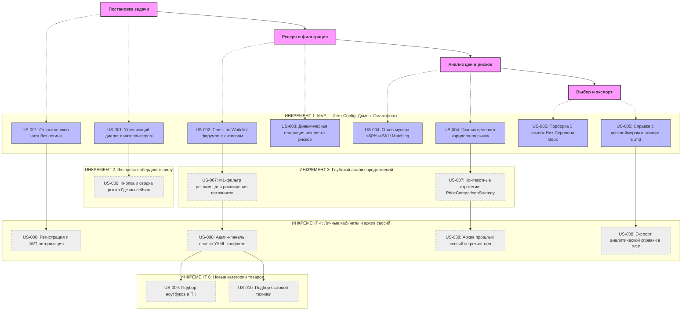

# User Story Map (USM) проекта SavvyShopper

Карта пользовательских историй отражает сквозной путь покупателя и разделение функциональности по инкрементам разработки.

```mermaid
graph TD
    %% 1. Основные активности пользователя (Горизонтальный путь)
    A1["Постановка задачи"] --> A2["Ресерч и фильтрация"]
    A2 --> A3["Анализ цен и рисков"]
    A3 --> A4["Выбор и экспорт"]

    %% 2. Инкремент 1: MVP
    subgraph MVP ["ИНКРЕМЕНТ 1: MVP — Zero-Config, Домен: Смартфоны"]
        M1["US-001: Открытое окно чата без логина"]
        M2["US-001: Уточняющий диалог с интервьюером"]
        M3["US-002: Поиск по Whitelist форумов + антиспам"]
        M4["US-003: Динамическая генерация чек-листа рисков"]
        M5["US-004: Отсев мусора <60% и SKU Matching"]
        M6["US-004: График ценового коридора по рынку"]
        M7["US-005: Подборка 3 ссылок Низ-Середина-Верх"]
        M8["US-005: Справка с дисклеймером и экспорт в .md"]
    end

    %% Связи активностей с задачами MVP
    A1 -.-> M1
    A1 -.-> M2
    A2 -.-> M3
    A2 -.-> M4
    A3 -.-> M5
    A3 -.-> M6
    A4 -.-> M7
    A4 -.-> M8

    %% 3. Инкремент 2: Экспресс-обзор рынка
    subgraph Inc2 ["ИНКРЕМЕНТ 2: Экспресс-онбординг в нишу"]
        I2_1["US-006: Кнопка и сводка рынка Где мы сейчас"]
    end

    %% 4. Инкремент 3: Контекстный анализ сделок
    subgraph Inc3 ["ИНКРЕМЕНТ 3: Глубокий анализ предложений"]
        I3_1["US-007: Контекстные стратегии PriceComparisonStrategy"]
        I3_2["US-007: ML-фильтр рекламы для расширения источников"]
    end

    %% 5. Инкремент 4: Персонализация и администрирование
    subgraph Inc4 ["ИНКРЕМЕНТ 4: Личные кабинеты и архив сессий"]
        I4_1["US-008: Регистрация и JWT-авторизация"]
        I4_2["US-008: Админ-панель правки YAML-конфигов"]
        I4_3["US-008: Архив прошлых сессий и трекинг цен"]
        I4_4["US-008: Экспорт аналитической справки в PDF"]
    end

    %% 6. Инкремент 6: Расширение товарных категорий
    subgraph Inc6 ["ИНКРЕМЕНТ 6: Новые категории товаров"]
        I6_1["US-009: Подбор ноутбуков и ПК"]
        I6_2["US-010: Подбор бытовой техники"]
    end

    %% Переходы между релизами
    M2 --> I2_1
    M6 --> I3_1
    M3 --> I3_2

    M1 --> I4_1
    I3_2 --> I4_2
    I3_1 --> I4_3
    M8 --> I4_4

    I4_2 --> I6_1
    I4_2 --> I6_2

    %% 7. Стили оформления
    classDef activityStyle fill:#f9f,stroke:#333,stroke-width:2px,font-weight:bold;
    classDef mvpStyle fill:#bbf,stroke:#333,stroke-width:1px;
    classDef futureStyle fill:#eee,stroke:#999,stroke-width:1px,stroke-dasharray: 5 5;

    class A1,A2,A3,A4 activityStyle;
    class M1,M2,M3,M4,M5,M6,M7,M8 mvpStyle;
    class I2_1,I3_1,I3_2,I4_1,I4_2,I4_3,I4_4,I6_1,I6_2 futureStyle;
```
